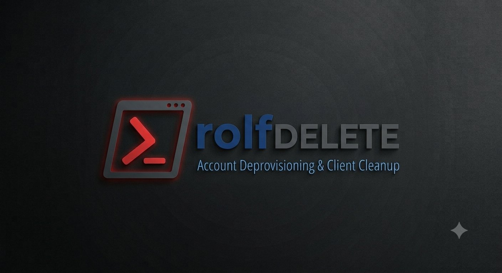
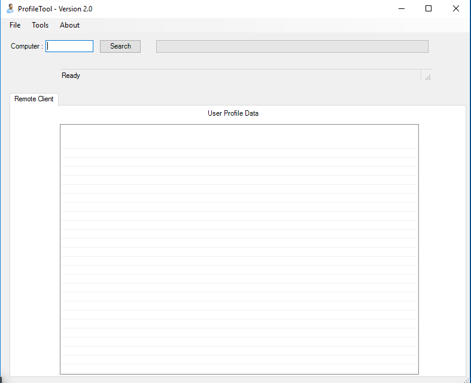
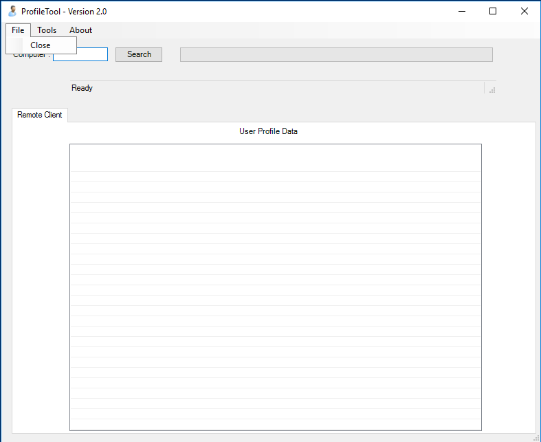
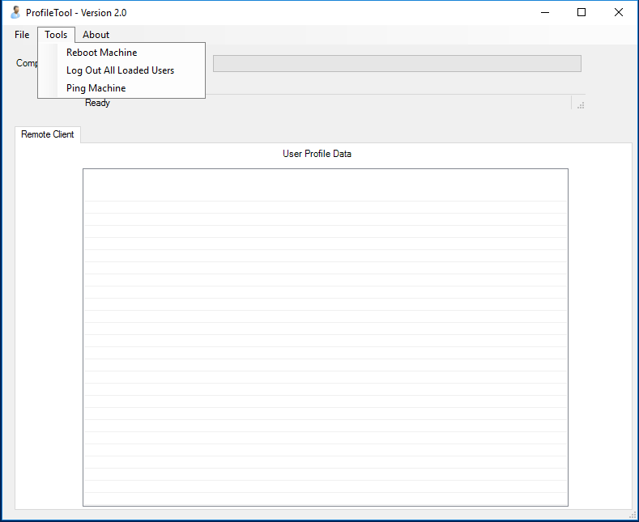
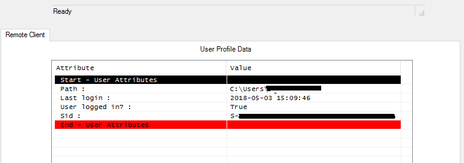
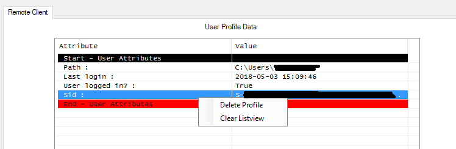
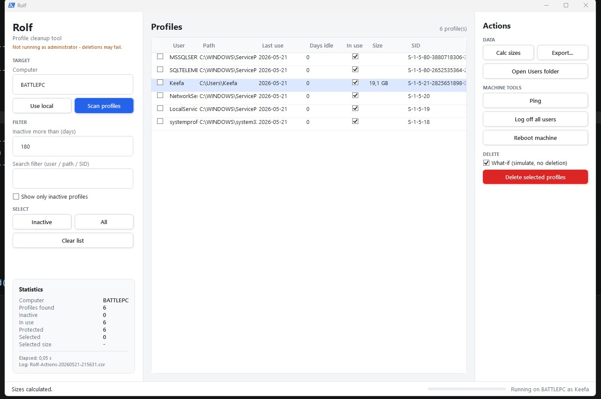

# Windows Profile Cleanup Tools



## Overview
This repository contains four PowerShell-based tools for managing and removing inactive local Windows user profiles.
These tools are designed for IT administrators who manage shared workstations, lab environments, terminal servers, or enterprise devices where inactive profiles consume unnecessary disk space.

---

## ⚠️ Warning
Deleting a profile permanently removes:
```
- User files
- AppData
- Desktop/Documents
- Registry profile entries
```
Use carefully in production environments.

The scripts are divided into:
```
- **CLI versions** (`PsRolf`) for automated or scheduled execution.
- **GUI versions** (`PsGuiRolf`) for interactive administration.
- Separate builds for **Windows 10** and **Windows 11**.
```

---

# Included Scripts
```
PsRolf - Win10 - Remove-InactiveLocalUserProfiles.ps1` : 
 CLI
  Removes inactive local profiles using WMI (`Win32_UserProfile`)
  Windows PowerShell : 5.1
  Permissions : Administrator
  Other : WMI Access is Required 
  Runs on win 10, Remove related registry entries under: HKLM:\SOFTWARE\Microsoft\Windows NT\CurrentVersion\ProfileList

PsGuiRolf - Win10 - Remove-InactiveLocalUserProfiles.ps1` : 
 GUI
  WPF GUI tool for remote profile administration
  Windows PowerShell : 5.1
  Permissions : Administrator
  Other : WMI Access is Required 
  Runs on win 10, Remove related registry entries under: HKLM:\SOFTWARE\Microsoft\Windows NT\CurrentVersion\ProfileList

PsRolf - Win11 - Remove-InactiveLocalUserProfiles.ps1` :
 CLI
  Modern CIM-based inactive profile cleanup ( CIM-based profile management )
  Windows PowerShell : 7
  Permissions : Administrator 
  Runs on win 11, Remove related registry entries under: HKLM:\SOFTWARE\Microsoft\Windows NT\CurrentVersion\ProfileList

PsGuiRolf - Win11 - Remove-InactiveLocalUserProfiles.ps1` : 
 GUI
  XAML GUI for local and remote profile cleanup
  Windows PowerShell : 7
  Permissions : Administrator 
  Runs on win 11, Remove related registry entries under: HKLM:\SOFTWARE\Microsoft\Windows NT\CurrentVersion\ProfileList
  
CLI Parameter - Option change
$DaysFilterAccounts = (Get-Date).AddDays(-180)

Default exclusions:
Administrator
Default
Default User
Public
WDAGUtilityAccount
```

---

# 🖥️ PsGuiRolf - Win10
```
`PsGuiRolf - Win10` is a Windows Forms PowerShell GUI application for managing local user profiles on remote computers.
The tool allows administrators to:
- Scan remote computers
- View user profile information
- Remove inactive profiles
- Reboot machines
- Log off users
- Open remote user directories
The application uses WMI for remote operations.
```





---

# 🖥️ PsGuiRolf - Win11
```
`PsGuiRolf - Win11` is the next-generation GUI where we go from WPF to XAML GUI application for managing local and remote Windows user profiles.
- XAML interface
- CIM operations
- WSMan → DCOM fallback
- Improved safety controls
- Better logging and exporting
It is designed for enterprise administration and modern Windows environments.
```



